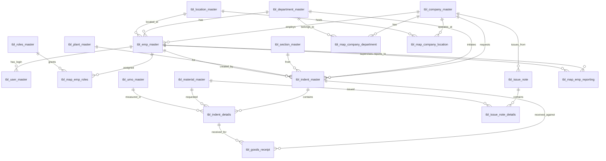
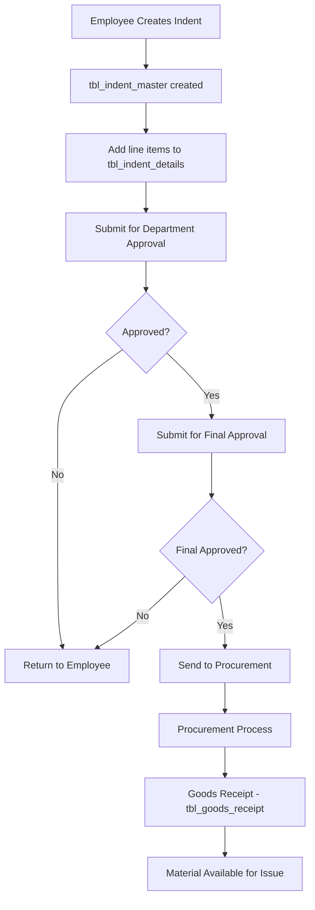
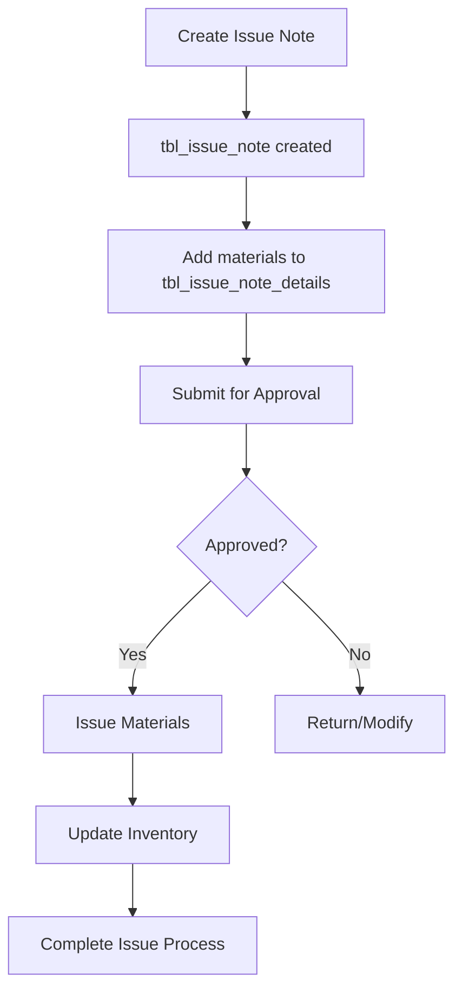

# ProcureZone Database Schema Documentation

## Overview

The ProcureZone application uses a MySQL database named `seeds_indent` that manages procurement, inventory, and employee data. This document provides comprehensive documentation of all tables, relationships, and their purposes.

## Database Information

- **Database Name:** `seeds_indent`
- **Database Type:** MySQL
- **Connection URL:** `jdbc:mysql://localhost:3306/seeds_indent`
- **Character Encoding:** UTF-8
- **Total Tables:** 42+ tables including master, mapping, and transaction tables

## Table Categories

### 1. Master Tables (Core Business Entities)

- **tbl_company_master** - Company information
- **tbl_emp_master** - Employee details
- **tbl_department_master** - Department information
- **tbl_location_master** - Location/site information
- **tbl_material_master** - Material/item catalog
- **tbl_plant_master** - Manufacturing plants
- **tbl_section_master** - Department sections
- **tbl_roles_master** - User roles and permissions
- **tbl_user_master** - User login credentials
- **tbl_umo_master** - Units of Measure
- **tbl_indent_status** - Status lookup for indents

### 2. Mapping Tables (Many-to-Many Relationships)

- **tbl_map_emp_roles** - Employee-Role assignments
- **tbl_map_company_department** - Company-Department associations
- **tbl_map_company_location** - Company-Location associations
- **tbl_map_company_location_material** - Material availability by location
- **tbl_map_company_plant_material** - Material availability by plant
- **tbl_map_company_emp** - Company-Employee associations
- **tbl_map_emp_reporting** - Employee reporting hierarchy

### 3. Transaction Tables (Business Processes)

- **tbl_indent_master** - Material requisition/indent requests
- **tbl_indent_details** - Line items for each indent
- **tbl_indent_procurement_logs** - Procurement activity logs
- **tbl_goods_receipt** - Goods receipt tracking
- **tbl_issue_note** - Material issue/dispatch notes
- **tbl_issue_note_details** - Issue note line items

### 4. ProcureZone Specific Tables (Enhanced Features)

- **pz_tbl_company_master** - Extended company information
- **tbl_pz_material_master** - Extended material catalog
- **tbl_pz_crops_type** - Agricultural crop types
- **tbl_pz_schedule_materialmaster** - Scheduled materials
- **tbl_pz_proc_pack** - Procurement packages
- Various other PZ-prefixed tables for enhanced functionality

## Detailed Table Descriptions

### Core Master Tables

#### tbl_company_master

Stores company/organization information.

| Column      | Type         | Description               |
| ----------- | ------------ | ------------------------- |
| comp_id     | INT (PK)     | Unique company identifier |
| comp_code   | VARCHAR(100) | Company code (unique)     |
| comp_name   | VARCHAR(100) | Company name              |
| comp_status | INT          | Active/inactive status    |
| comp_lmd    | DATE         | Last modified date        |
| comp_lmu    | INT (FK)     | Last modified user        |

#### tbl_emp_master

Central employee information table.

| Column          | Type         | Description             |
| --------------- | ------------ | ----------------------- |
| emp_number      | INT (PK)     | Unique employee number  |
| emp_id          | VARCHAR(100) | Employee ID (unique)    |
| emp_name        | VARCHAR(100) | Employee full name      |
| emp_email       | VARCHAR(100) | Email address (unique)  |
| emp_password    | VARCHAR(500) | Encrypted password      |
| emp_join_date   | DATE         | Date of joining         |
| emp_designation | VARCHAR(100) | Job designation         |
| emp_cost_center | VARCHAR(500) | Cost center allocation  |
| emp_path        | MEDIUMTEXT   | Employee hierarchy path |
| emp_status      | INT          | Active/inactive status  |
| emp_department  | INT (FK)     | Department reference    |
| emp_location    | INT (FK)     | Location reference      |
| emp_company     | INT (FK)     | Company reference       |
| emp_plant       | VARCHAR(100) | Plant assignment        |

#### tbl_indent_master

Material requisition/request master table.

| Column                         | Type         | Description              |
| ------------------------------ | ------------ | ------------------------ |
| indent_id                      | INT (PK)     | Unique indent identifier |
| indent_no                      | VARCHAR(100) | Indent number            |
| indent_year                    | VARCHAR(45)  | Financial year           |
| indent_date                    | VARCHAR(20)  | Indent creation date     |
| indent_company                 | INT (FK)     | Requesting company       |
| indent_dept                    | INT (FK)     | Requesting department    |
| indent_sec                     | INT (FK)     | Requesting section       |
| indent_plant                   | INT (FK)     | Requesting plant         |
| indent_emp                     | INT (FK)     | Requesting employee      |
| indent_createdby               | INT (FK)     | Created by employee      |
| indent_approvedby              | INT (FK)     | Approved by employee     |
| indent_final_approvedby        | INT (FK)     | Final approver           |
| indent_procurementby           | INT (FK)     | Procurement handler      |
| indent_status                  | INT          | Current status           |
| Various status and date fields |              | Workflow tracking        |

#### tbl_indent_details

Line items for each material requisition.

| Column                    | Type          | Description             |
| ------------------------- | ------------- | ----------------------- |
| indent_details_id         | INT (PK)      | Unique detail line ID   |
| indent_id                 | INT (FK)      | Parent indent reference |
| indent_details_material   | INT (FK)      | Material/item reference |
| indent_details_umo        | INT (FK)      | Unit of measure         |
| indent_details_qty        | DECIMAL(20,0) | Requested quantity      |
| indent_details_stock_aval | DECIMAL(20,0) | Available stock         |
| indent_details_pricing    | DECIMAL(20,0) | Estimated price         |
| indent_details_purpose    | MEDIUMTEXT    | Purpose/justification   |
| indent_details_vendor     | VARCHAR(200)  | Preferred vendor        |

## Entity Relationship Diagram

## Business Process Flow

### 1. Material Requisition Process

### 2. Material Issue Process

## Key Relationships

### Primary Relationships

1. **Company → Employee**: One company can have many employees
2. **Department → Employee**: One department can have many employees
3. **Location → Employee**: One location can have many employees
4. **Employee → User**: One employee can have one user account
5. **Employee → Roles**: Many-to-many through tbl_map_emp_roles
6. **Indent → Indent Details**: One indent can have many line items
7. **Material → Indent Details**: One material can appear in many indents
8. **Indent → Goods Receipt**: One indent can have multiple receipts
9. **Issue Note → Issue Details**: One issue note can have many line items

### Mapping Relationships

1. **Company ↔ Department**: Many-to-many through tbl_map_company_department
2. **Company ↔ Location**: Many-to-many through tbl_map_company_location
3. **Company ↔ Employee**: Many-to-many through tbl_map_company_emp
4. **Employee Hierarchy**: Self-referencing through tbl_map_emp_reporting
5. **Material Availability**: Tracked through location and plant mapping tables

## Data Integrity Constraints

### Primary Keys

- All tables have AUTO_INCREMENT primary keys
- Ensures unique record identification

### Foreign Keys

- Extensive foreign key relationships maintain referential integrity
- Cascading rules prevent orphaned records
- Employee references in all audit fields (created_by, modified_by)

### Unique Constraints

- Company codes, employee IDs, material codes are unique
- Prevents duplicate master data
- Composite unique keys on mapping tables

### Check Constraints

- Status fields typically use integer codes (0=inactive, 1=active)
- Date fields maintain proper formats
- Quantity fields prevent negative values

## Audit Trail Features

### Standard Audit Fields

Every table includes:

- **\_lmd**: Last Modified Date
- **\_lmu**: Last Modified User (FK to tbl_emp_master)
- **\_status**: Record status (active/inactive)

### Change Tracking

- tbl_indent_procurement_logs tracks procurement activities
- Date and user stamps on approval workflows
- Comprehensive history of material movements

## Security Considerations

### User Authentication

- tbl_user_master stores encrypted passwords
- tbl_emp_master links to user accounts
- Role-based access through tbl_map_emp_roles

### Data Access Control

- Company-based data segregation
- Department and location-based filtering
- Employee hierarchy enforcement

## Performance Optimizations

### Indexes

- Primary keys (automatic clustered indexes)
- Foreign key indexes for join performance
- Status field indexes for filtering
- Date range indexes for reporting
- Composite indexes on frequently queried combinations

### Partitioning Recommendations

- Consider date-based partitioning for:
  - tbl_indent_master (by indent_year)
  - tbl_goods_receipt (by creation date)
  - tbl_issue_note (by issue_year)

## Common Queries and Usage Patterns

### Frequent Query Types

1. **Employee Authentication**: JOIN user_master with emp_master
2. **Indent Reporting**: JOIN indent_master with details and materials
3. **Approval Workflows**: Filter by status and employee roles
4. **Inventory Tracking**: Aggregate goods receipts and issues
5. **Company Dashboards**: Filter all data by company context

### Reporting Views

Consider creating views for:

- Employee with department and location details
- Complete indent information with approvals
- Material availability across locations
- Company-wise transaction summaries

## Migration and Maintenance

### Data Migration

- Use the provided SQL script to create complete schema
- Import master data before transaction data
- Maintain referential integrity during migration

### Regular Maintenance

- Monitor index performance
- Archive old transaction data
- Regular backup of master data
- Update statistics for query optimization

## ProcureZone Extensions

The application includes enhanced tables prefixed with "pz\_" for:

- Extended company management
- Agricultural crop tracking
- Advanced material scheduling
- Procurement packaging
- Enhanced plant and storage location management

These extensions provide industry-specific functionality while maintaining compatibility with the core procurement system.

## Conclusion

This database schema provides a comprehensive foundation for procurement management with strong data integrity, audit capabilities, and performance optimization. The modular design allows for extensions while maintaining core functionality.

